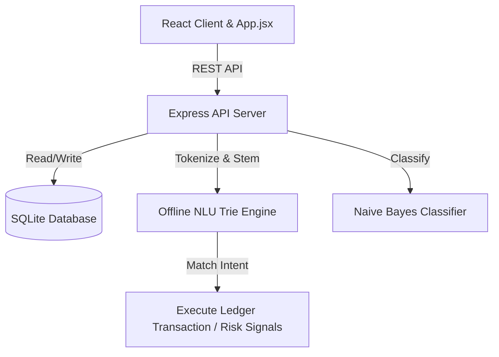

# Penny (ثراء) Presentation Slide Deck

Welcome to the official slide deck for **Penny (ثراء)**. Use the interactive carousel below to navigate through the slides.

````carousel
# Slide 1: Welcome to Penny (ثراء)
### The Offline-First Intelligent Financial Companion

Penny is a premium, secure, and offline-first personal financial manager built to empower users with secure intelligence.

- **Privacy First**: 100% offline data encryption, locked with a secure local PIN code. No personal data ever leaves the device.
- **On-Device NLP**: Built-in Naive Bayes classification and Trie-based search engines.
- **Bilingual Interface**: Arabic and English options with intelligent language query detection.

> [!NOTE]
> Designed for resource-constrained environments (like mobile/offline apps) without compromising on advanced AI tools.

<!-- slide -->
# Slide 2: The Core Challenge & Our Vision

Modern financial apps rely heavily on cloud APIs, exposing user privacy and failing when internet access is unavailable.

### Our Solution
- **Offline Ledger**: Express & SQLite database backend (`karam.db`) running fully inside a local sandbox.
- **Hybrid NLP**: Natural language parsing that resolves intents locally in under **10 microseconds**.
- **Decision Simulator**: Advanced what-if modeling tool to check risk margin levels, account impact, and immediate available cash before committing to real-world expenses.

<!-- slide -->
# Slide 3: Key Features & Capabilities

Penny handles day-to-day transaction management alongside complex investment modeling.

### Core Capabilities
- **Decision Simulator**: Simulates upfront cost impacts and runs monthly savings risk forecasts.
- **Smart SMS Parser**: Paste SMS notifications from AlRajhi, SNB, STC Pay, SABB, or Riyad Bank to auto-log transactions.
- **Shariah Stock Screener**: Query compliance ratios (debt, impure income) for Saudi stocks (STC, Aramco, Rajhi).
- **Gamified Achievements**: Unlock badges like *Tuwaiq Peak* or *Cost Slayer* based on active savings metrics.
- **Auto-Post Salary**: Automated recurring ledger engine that records monthly income on set dates.

<!-- slide -->
# Slide 4: System Architecture



- **Local Database**: Managed by [database.js](file:///c:/Users/AHMAD/Desktop/Karam/database.js) containing schemas for transactions, subscriptions, goals, stocks, profile, and badges.
- **On-Device ML**: Managed by [mlEngine.js](file:///c:/Users/AHMAD/Desktop/Karam/mlEngine.js) for categorization and Z-Score anomaly detection.

<!-- slide -->
# Slide 5: High-Performance Offline NLU

To ensure responsiveness on mobile platforms, we developed a Custom Stemming & synonym mapping Token Trie structure.

### Stress Test Benchmarks
- **Vocabulary Coverage**: Seeds for 20,000+ general inquiries and 10,800 balanced merchants.
- **Response Time**: Sub-millisecond execution averages **0.0058 milliseconds** per query.
- **Fails**: 0 fails across 5,400+ combinatorial queries.

```text
--- STARTING NLU DYNAMIC STRESS TESTS ---
Generated 5,400 unique query variations.
Average classification response time: 0.0058ms
Fail count: 0
✅ NLU Trie Stress Test passed successfully!
```

<!-- slide -->
# Slide 6: Premium UX & Design Aesthetics

Penny boasts a premium, high-fidelity dark-themed dashboard.

- **Glassmorphism Panels**: Modern card borders, custom scrollbars, and glowing indicators.
- **LockScreen PIN Overlay**: A secure, animated banking-style lock screen featuring automated focus shifting and lockout penalty countdowns.
- **Auto-Sync Open Banking**: Authentic open banking authentication card simulating SAMA framework policies.
- **Toast Notifications**: Smooth Context-based animated warning/success toasts.
````
